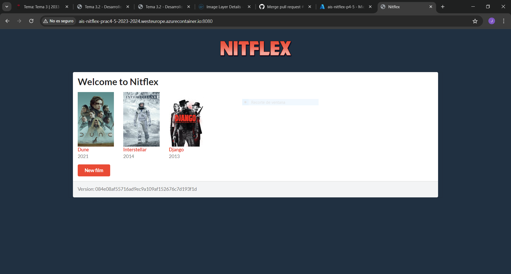
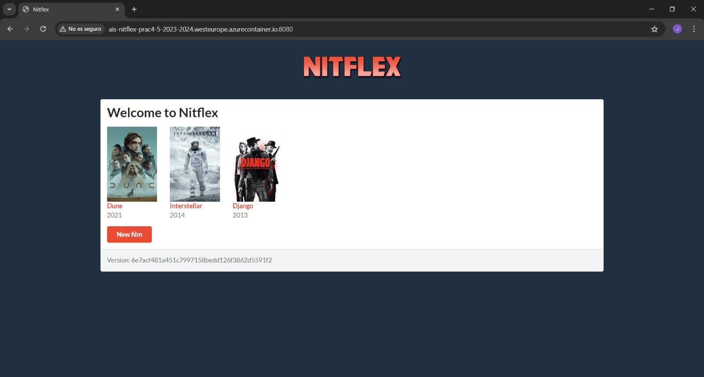

# AIS-Practicas-4y5-2024

Autor(es): Javier Romero García y Loreto Uzquiano Esteban.

[Repositorio](https://github.com/Sirmagnetone/ais-l.uzquiano.2021-j.romerog.2021-2024-ghf.git)

[Aplicación Azure](http://ais-nitflex-prac4-5-2023-2024.westeurope.azurecontainer.io:8080)


## Desarrollo con GitHubFlow (Práctica 5)

Una vez creados los workflows y funcionando estos, pasamos a crear la nueva funcionalidad utilizando GitHub Flow:

Clonamos el repositorio mediante el siguiente comando.

```
$ git clone git@github.com:Sirmagnetone/ais-l.uzquiano.2021-j.romerog.2021-2024-ghf.git
```

Cada desarrollador cambió a su rama correspondiente usando el siguiente comando. La opción -b hace que se creen las ramas, ya que aún no existen.

```
$ git checkout -b Fix_1

$ git checkout -b funcionalidad_1
```

### Fix_1
Se añadieron los cambios necesarios para poder arreglar el bug, mediante los siguientes comandos:
- git status para ver el estado del repositorio.
- git add para añadir los cambios.
- git commit para crear una nueva mini-versión.

```
$ git status
$ git add <Ruta fichero modificado>
$ git commit -m <Nombre del commit>
```

Una vez añadidos todos los cambios, los subimos mediante el siguiente comando:
```
$ git push
```

Se hicieron un total de 2 pushs para arreglar este bug.
Al hacer cada push, se desencadenó el workflow 1 un total de 2 veces. Los resultados son los siguientes:
- [Resultado 1](https://github.com/Sirmagnetone/ais-l.uzquiano.2021-j.romerog.2021-2024-ghf/actions/runs/9097997764)
- [Resultado 2](https://github.com/Sirmagnetone/ais-l.uzquiano.2021-j.romerog.2021-2024-ghf/actions/runs/9098407098)

### Funcionalidad_1

Se añadieron los cambios necesarios para poder implementar la funcionalidad, mediante los siguientes comandos:
- git status para ver el estado del repositorio.
- git add para añadir los cambios.
- git commit para crear una nueva mini-versión.

```
$ git status
$ git add <Ruta fichero modificado>
$ git commit -m <Nombre del commit>
```

Una vez añadidos todos los cambios, los subimos mediante el siguiente comando:
```
$ git push
```

Se hicieron un total de 3 pushs para implementar esta funcionalidad.
Al hacer cada push, se desencadenó el workflow 1 un total de 3 veces. Los resultados son los siguientes:
- [Resultado 1](https://github.com/Sirmagnetone/ais-l.uzquiano.2021-j.romerog.2021-2024-ghf/actions/runs/9098408534)
- [Resultado 2](https://github.com/Sirmagnetone/ais-l.uzquiano.2021-j.romerog.2021-2024-ghf/actions/runs/9098452578)
- [Resultado 3](https://github.com/Sirmagnetone/ais-l.uzquiano.2021-j.romerog.2021-2024-ghf/actions/runs/9098516013)


### Pull-Request (Fix_1)

Primero se hizo el pull request de la rama Fix_1, desde la web de GitHub.

Al hacer esto, se desencadenó el workflow 2, dando este [resultado](https://github.com/Sirmagnetone/ais-l.uzquiano.2021-j.romerog.2021-2024-ghf/actions/runs/9098587183).

Como todos los tests pasaron, y no había conflictos, se integraron los cambios en la rama main con los siguientes comandos:
- git checkout para volver a la rama main.
- git merge para unificar la rama de producción Fix_1 con la rama main.
- git push para subir los cambios a main.

```
$ git checkout main
$ git merge Fix_1
$ git push
```

Esto desencadenó el workflow 3, dando este [resultado](https://github.com/Sirmagnetone/ais-l.uzquiano.2021-j.romerog.2021-2024-ghf/actions/runs/9098628021).
- [Imagen Docker](https://hub.docker.com/layers/sirmagnetone/nitflex/00fdef8bc2d9dcfae1270079157b39163df2e38c/images/sha256-2d6e8a6ae5bfd7a91df0bfa5d4fad735e2ca46840f1c197ad913398215942a80?context=repo)

### Pull-Request (funcionalidad_1)

Por último se hizo un pull request de la rama funcionalidad_1 desde la web de GitHub.

En este paso nos encontramos conflictos. Para ver los conflictos que ocurrieron, ejecutamos los siguientes comandos:

- git pull origin main para actualizar la rama local con los cambios de la rama main del repositorio remoto.
- git checkout para volver a la rama funcionalidad_1.
- git merge main para unificar la rama de producción funcionalidad_1 con la rama main.

```
$ git pull origin main
$ git checkout funcionalidad_1
$ git merge main
```
Los conflictos fueron resueltos en el IDE (IntelliJ), y fueron subidos mediante los siguientes comandos:

- git push -u para subir los cambios locales a la rama remota.
- git add para añadir los cambios.
- git commit para crear una nueva mini-versión.
- git push para subir los cambios a funcionalidad_1.

```
$ git push -u origin funcionalidad_1
$ git add <Fichero modificado>
$ git commit -m "Resolve Conflicts"
$ git push
```

En este punto, resueltos los conflictos, se desencadenaron el workflow 1 y 2, dando los siguientes resultados:
- [Resultado workflow 1](https://github.com/Sirmagnetone/ais-l.uzquiano.2021-j.romerog.2021-2024-ghf/actions/runs/9098961783)
- [Resultado workflow 2](https://github.com/Sirmagnetone/ais-l.uzquiano.2021-j.romerog.2021-2024-ghf/actions/runs/9098962204)

Después, integramos los cambios en la rama main con los siguientes comandos:
- git checkout para volver a la rama main.
- git merge para unificar la rama de producción funcionalidad_1 con la rama main.
- git push para subir los cambios a main.

```
$ git checkout main
$ git merge funcionalidad_1
$ git push
```

Esto desencadenó el workflow 3, dando este [resultado](https://github.com/Sirmagnetone/ais-l.uzquiano.2021-j.romerog.2021-2024-ghf/actions/runs/9099128111) y desplegando la siguiente aplicación:


- [Imagen Docker](https://hub.docker.com/layers/sirmagnetone/nitflex/084e08af55716ad9ec9a109af152676c7d193f1d/images/sha256-ee37acdce2b075ef393535937d6e2b4a120b3cf1c715cc7f57ab39dc576c6323?context=repo)

### Fix_2
Después de haber implementado tanto la nueva funcionalidad como el arreglo del bug, nos dimos cuenta de que el workflow 4 no se ejecutaba bien, ya que en uno de los tests de Selenium (concretamente el que se encargaba de comprobar que el botón "Cancel" funcionase correctamente), nos faltaban las esperas.
Por ello, añadimos los cambios necesarios para poder arreglarlo, mediante los siguientes comandos:
- git status para ver el estado del repositorio.
- git add para añadir los cambios.
- git commit para crear una nueva mini-versión.

```
$ git status
$ git add <Ruta fichero modificado>
$ git commit -m <Nombre del commit>
```

Una vez añadidos todos los cambios, los subimos mediante el siguiente comando:
```
$ git push
```

Se hicieron un total de 2 pushs para arreglar este bug.
Al hacer cada push, se desencadenó el workflow 1 un total de 2 veces. Los resultados son los siguientes:
- [Resultado 1](https://github.com/Sirmagnetone/ais-l.uzquiano.2021-j.romerog.2021-2024-ghf/actions/runs/9156833230)
- [Resultado 2](https://github.com/Sirmagnetone/ais-l.uzquiano.2021-j.romerog.2021-2024-ghf/actions/runs/9157147380)

### Pull-Request (Fix_2)

Se hizo el pull request de la rama Fix_2, desde la web de GitHub.

Al hacer esto, se desencadenó el workflow 2, dando este [resultado](https://github.com/Sirmagnetone/ais-l.uzquiano.2021-j.romerog.2021-2024-ghf/actions/runs/9157185507).

Como todos los tests pasaron, y no había conflictos, se integraron los cambios en la rama main con los siguientes comandos:
- git checkout para volver a la rama main.
- git merge para unificar la rama de producción Fix_2 con la rama main.
- git push para subir los cambios a main.

```
$ git checkout main
$ git merge Fix_2
$ git push
```

Esto desencadenó el workflow 3, dando este [resultado](https://github.com/Sirmagnetone/ais-l.uzquiano.2021-j.romerog.2021-2024-ghf/actions/runs/9157218203) y desplegando la siguiente aplicación:


- [Imagen Docker](https://hub.docker.com/layers/sirmagnetone/nitflex/6e7acf481a451c7997158bedd126f3862d5591f2/images/sha256-58b1f6c15ab70c465bd1bda928b8e4f429daa3b4056a42a00c5ebab74c8cb517?context=repo)

### Nightly
Para terminar, el workflow 4 está diseñado para que el SeleniumTest se ejecute en distintos navegadores y sistemas operativos.
Esto se realiza diariamente a la hora elegida, en este caso, a las 2:00 AM.
La última ejecución de este workflow es la siguiente:

[Última ejecución](https://github.com/Sirmagnetone/ais-l.uzquiano.2021-j.romerog.2021-2024-ghf/actions/runs/9167894507)